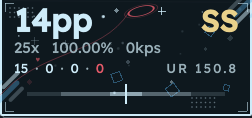
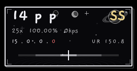

# osu!SayoHub

**All-in-one desktop companion for [osu!lazer](https://osu.ppy.sh) — live PP overlay with a hit-error meter, plus a config hub for the SayoDevice O3C keypad.**

<p align="center">
  
  &nbsp;&nbsp;
  
</p>

<p align="center">
  <em>The overlay re-themes itself to match the skin you're playing —<br>
  Arona &amp; Plana (Blue Archive) pastel on the left, FOOL MOON NIGHT hand-drawn ink on the right.</em>
</p>

> **Platform:** Linux only for now (built for Wayland/Hyprland, X11 works too).
> A **Windows port is planned** — stay tuned.

---

## ✨ Features

### 🎯 Live gameplay overlay
- **Live PP**, combo, accuracy, grade and hit counts — streamed from [tosu](https://tosu.app) over its local WebSocket, no osu! plugins needed
- **Hit-error meter** with fading tick marks and 300/100/50 windows, plus **UR (unstable rate)** readout
- **KPS counter** with an evdev-based fallback UR when telemetry doesn't provide one
- **Click-through & focus-free** — the overlay never steals input from the game (wlr-layer-shell on Wayland)
- Auto-hides outside gameplay

### 🎨 Skin-driven themes
The overlay reads the **active skin name from osu!lazer** (via tosu) and switches its entire look on the fly:

| Skin | Theme |
|---|---|
| FOOL MOON NIGHT | Hand-drawn monochrome ink: hatched planets, crescent moon, twinkling stars, water ripples, Gaegu font |
| Arona & Plana (HK7205A) | Blue Archive pastel: red halo with its trailing string, stripe clusters, drifting diamonds, Readex Pro font — colors sampled from the skin's own `skin.ini` |
| anything else | Falls back to the ink theme |

Everything is painted procedurally — no image assets, just code. Adding a theme for your skin is a single palette entry in [`osusayohub/overlay/theme.py`](osusayohub/overlay/theme.py).

### ⌨️ SayoDevice O3C config hub
- Key bindings, RGB lighting and device settings over raw HID — no SayoDevice web configurator needed
- Protocol implemented from scratch and verified on hardware (64-byte reports, checksummed)
- Writes go to device RAM with an explicit *save to flash* step

## 🚀 Getting started

### Requirements
- Linux (Wayland with `layer-shell-qt` for the true overlay experience; X11 falls back to a frameless always-on-top window)
- [osu!lazer](https://osu.ppy.sh/home/download) + [tosu](https://tosu.app) running (`localhost:24050`)
- Python ≥ 3.11, PyQt6

### Arch Linux
```sh
git clone https://github.com/cavalinho-xdd/osusayohub.git
cd osusayohub
makepkg -si
```

### Anywhere else
```sh
pip install .
osusayohub
```

## 🧩 How it works

```
osu!lazer ──▶ tosu ──▶ WebSocket (localhost:24050) ──▶ telemetry listener
                                                          │
              evdev (read-only clicks) ──▶ UR fallback ───┤
                                                          ▼
                                              Qt overlay (layer-shell)
                                                 theme ⇆ active skin

SayoDevice O3C ◀── raw HID (write-only config channel) ◀── config hub UI
```

- Single asyncio loop inside the Qt main loop (qasync) — no threads
- Input monitoring and device config are strictly isolated modules
- Telemetry UR wins; evdev rhythm-stability UR only fills the gaps

## 🗺️ Roadmap

- [ ] **Windows port**
- [ ] More skin themes
- [ ] Theme editor in the config hub

## 📄 License

MIT. Bundled fonts ([Gaegu](https://fonts.google.com/specimen/Gaegu), [Readex Pro](https://fonts.google.com/specimen/Readex+Pro)) are licensed under the SIL Open Font License.
